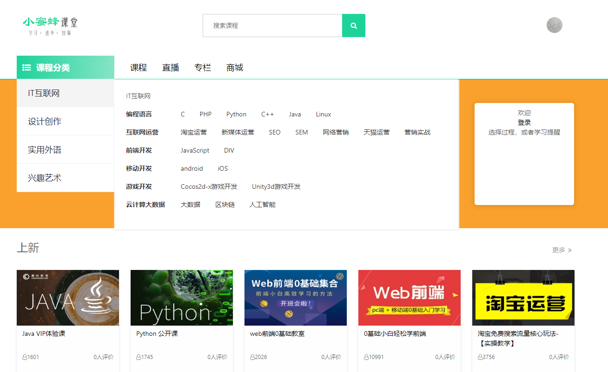
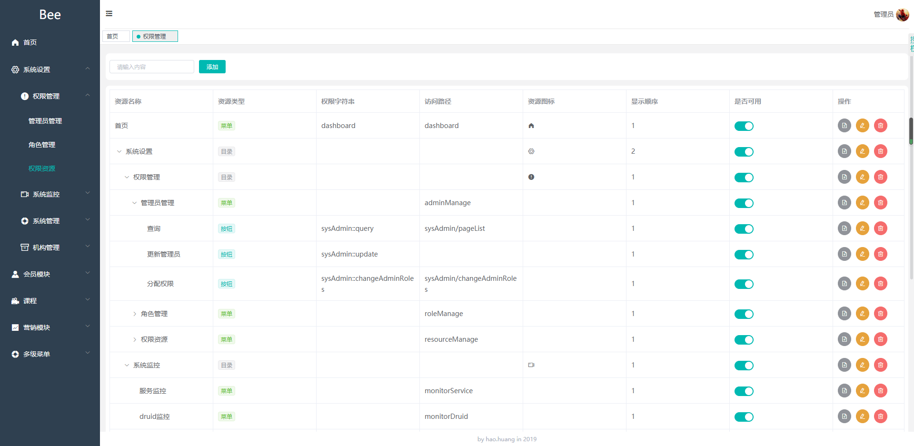

# beeclub
    
   实践驱动学习
    
## 说明
  
   beeclub项目采用当前流行技术栈，以打造一个完整的线上课堂系统
      
   课程资料来源于 [潭州课堂](https://www.shiguangkey.com/)

## 文档
    

## 介绍
   `beeclub`项目是一套线上课堂系统，包含pc门户及后台管理系统

## 演示
   
   项目包含pc门户、后台管理
   ### pc门户
   
   门户项目: [https://github.com/beeclub/beeclub-app/tree/master/beeclub-pc](https://github.com/beeclub/beeclub-app/beeclub-pc)
   
   
   
   ### 后台管理
   后台管理前端项目地址：[https://github.com/beeclub/beeclub-app/tree/master/beeclub-admin](https://github.com/beeclub/beeclub-app/beeclub-admin)
   
   

## 技术选型

| 技术 | 说明 | 地址      |
| ---- | -----| ----------|
    

## 项目架构

## 环境搭建
### 开发环境

### 开发工具
### 部署步骤

## 参考资料

## 许可证
